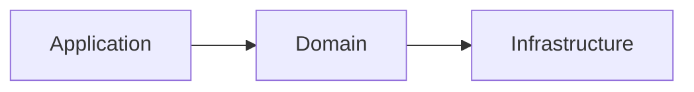
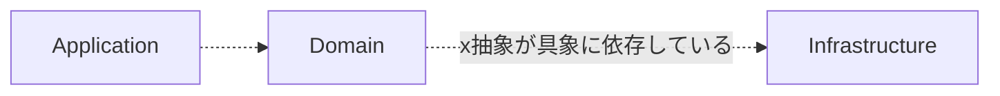
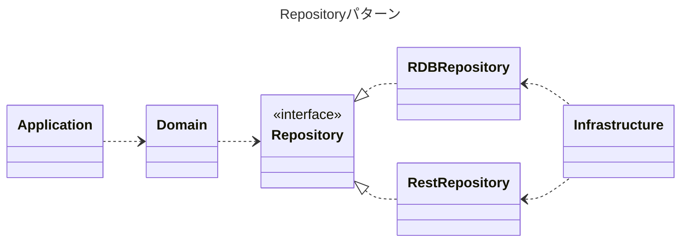
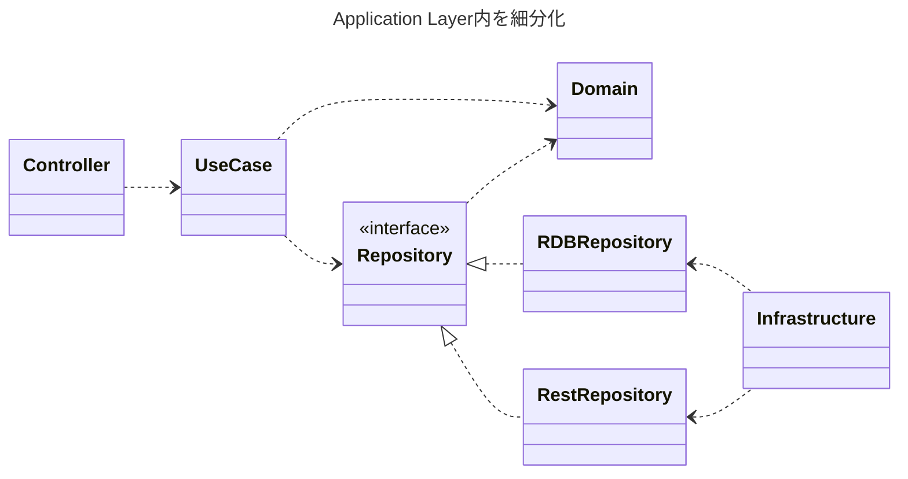

---
# try also 'default' to start simple
theme: seriph
# random image from a curated Unsplash collection by Anthony
# like them? see https://unsplash.com/collections/94734566/slidev
background: https://source.unsplash.com/collection/94734566/1920x1080
# apply any windi css classes to the current slide
class: 'text-center'
# https://sli.dev/custom/highlighters.html
highlighter: shiki
# show line numbers in code blocks
lineNumbers: false
title: ActiveRecordパターンの呪縛を学びほぐして挑むクリーンアーキテクチャへの入り口
# some information about the slides, markdown enabled
info: |
 ActiveRecordパターンに引きづられて設計が歪みがちになるのを学びほぐすことでクリーンアーキテクチャでの開発の良いスタートラインに立てるのではないでしょうか？

# persist drawings in exports and build
drawings:
  persist: false
# page transition
transition: slide-left
# use UnoCSS
css: unocss
fonts:
  # basically the text
  sans: 'Noto Sans JP'
  # use with `font-serif` css class from windicss
  serif: 'Noto Serif JP'
  # for code blocks, inline code, etc.
  mono: 'Noto Sans Mono'
addons:
  - "@katzumi/slidev-addon-qrcode"
  - "@katzumi/slidev-addon-blog-card"
  - "slidev-addon-components"
---

# ActiveRecordパターンの呪縛を学びほぐして挑むクリーンアーキテクチャへの入り口

[PHPカンファレンス沖縄2023](https://phpcon.okinawa.jp/)　Sep 16th, 2023.  
v0.0.1

<div class="pt-12">
  <span @click="$slidev.nav.next" class="px-2 py-1 rounded cursor-pointer" hover="bg-white bg-opacity-10">
    Press Space for next page <carbon:arrow-right class="inline"/>
  </span>
</div>

<div class="abs-br m-6 flex gap-2">
  <button @click="$slidev.nav.openInEditor()" title="Open in Editor" class="text-xl slidev-icon-btn opacity-50 !border-none !hover:text-white">
    <carbon:edit />
  </button>
  <a href="https://github.com/k2tzumi/clean-architecture-anti-pattern/blob/main/slides.md" target="_blank" alt="GitHub"
    class="text-xl slidev-icon-btn opacity-50 !border-none !hover:text-white">
    <carbon-logo-github />
  </a>
</div>

<!--
The last comment block of each slide will be treated as slide notes. It will be visible and editable in Presenter Mode along with the slide. [Read more in the docs](https://sli.dev/guide/syntax.html#notes)
-->

---
transition: fade-out
layout: two-cols-header
---

# 自己紹介

katzumi（かつみ）と申します  

「障害のない社会をつくる」をビジョンに掲げている「りたりこ」という会社に所属しています
<a href="https://litalico.co.jp/">

</a>

以下のアカウントで活動しています    

::left::

  
<QRCode width="180" height="180" value="https://twitter.com/katzchum" color="4329B9" image="Logo_of_Twitter.svg" />

<logos-twitter /> [katzchum](https://twitter.com/katzchum)

::right::


<logos-github-octocat /> [k2tzumi](https://github.com/k2tzumi)  
<simple-icons-zenn /> [katzumi](https://zenn.dev/katzumi)  

<br />

<style>
h1 {
  background-color: #2B90B6;
  background-image: linear-gradient(45deg, #4EC5D4 10%, #146b8c 20%);
  background-size: 100%;
  -webkit-background-clip: text;
  -moz-background-clip: text;
  -webkit-text-fill-color: transparent;
  -moz-text-fill-color: transparent;
}
</style>

---
layout: default
---

# 学びほぐす「アンラーニング」とは？
What's unlearning?

<blockquote>
        <p>既得の知識・習慣を捨てること。</p>
        <p>環境変化の激しい現代社会を生き抜くために、過去の経験にとらわれないよう、意識的に学習知識を捨て去ること。</p>
</blockquote>

[コトバンク（デジタル大辞泉）より](https://kotobank.jp/word/%E3%82%A2%E3%83%B3%E3%83%A9%E3%83%BC%E3%83%8B%E3%83%B3%E3%82%B0-178709)


---
layout: default
---

# ActiveRecordパターンとは？

皆んな大好きActiveRecordパターン  

データベースの操作をオブジェクト指向のアプローチで行うためのデザインパターン  
具体的には、ActiveRecordパターンでは、データベースの各テーブルに対応するモデル（クラス）を作成します。  
このモデルは、データベーステーブルの行と1対1で対応し、各行の属性（カラム）はモデルのプロパティになります。  
これにより、データベースの操作をオブジェクト指向の方法で行えるようになります。[^1]

[^1]: ChatGPTさん曰く


---
layout: center
transition: fade
---

# PHPのクラスでパターンを実装してみると

---
layout: two-cols
---

```php
class User {
    /**
     * @var int $id
     * @var string $username
     * @var string $email
     */
    public function __construct(
      private int $id,
      public string $username,
      public string $email
    ) {
    }

    // ユーザー情報をデータベースに保存するメソッド
    public function save(): void {
        // データベースに接続し、情報を保存
    }

    // ユーザー情報を更新するメソッド
    public function update(): void {
        // データベースに接続し、情報を更新する
    }

    // ユーザー情報を削除するメソッド
    public function delete(): void {
        // データベースから情報を削除する
    }
```

::right::

```php
    /**
     * IDを指定してユーザーを取得する静的メソッド
     * @param int $id
     * @return self
     */
    public static function find(int $id): self {
        // データベースから指定されたIDのユーザー情報を取得する
    }

    /**
     * すべてのユーザーを取得する静的メソッド
     * @return list<self>
     */
    public static function all(): array {
        // データベースからすべてのユーザー情報を取得する
    }
}
```

---
layout: center
transition: fade-out
---

# 各種フレームワーク・ライブラリで採用

---
layout: two-cols
---

## フルスタックフレームワーク

* Laravel <skill-icons-laravel-light />  
Eloquent ORM
* Symfony <skill-icons-symfony-light />  
Doctrine ORM
* Yii framework <devicon-yii-wordmark />  
ActiveRecord
* Ruby on Rails <logos-rails />  
ActiveRecord
* Spring Boot <devicon-spring-wordmark />  
Spring Data JPA

::right::

## ライブラリ

* Java <devicon-java-wordmark />  
Hibernate
* Golang <logos-gopher />  
GORM, XORM

---

# Eloquent ORMでのモデル作成


```console
$ php artisan make:model User
```
こうして

<v-click>
```php
namespace App\Models;

use Illuminate\Database\Eloquent\Model;

class User extends Model
{
    protected $fillable = ['username', 'email'];

    protected $table = 'users';
}
```

こうなる（する）
</v-click>

---

# Eloquentモデルの使い勝手

```php {1-7|8-12|13-16|17-22}
use App\Models\User;

// ユーザーを作成
$user = new User();
$user->username = 'john_doe';
$user->email = 'john@example.com';
$user->save();

// ユーザーを更新
$user = User::find(1);
$user->email = 'updated_email@example.com';
$user->save();

// ユーザーを削除
$user = User::find(1);
$user->delete();

// ユーザーを検索
$users = User::all();
foreach ($users as $user) {
    echo $user->username . ': ' . $user->email . PHP_EOL;
}
```

---
layout: center
---

# 👍 超絶便利！

---
layout: center
---

# SQL書かなくていい！
# テーブルとオブジェクトが自動的にマッピングされる！

---
layout: center
transition: slide-up
---

# 深掘りしてみる

---
layout: image-right
image: https://m.media-amazon.com/images/I/51QgGZaWj-L._SX515_BO1,204,203,200_.jpg
---

# 由来

RailsのActiveRecordが初出ではない

Ruby on RailsのActiveRecordという名称は、2002年にマーチンファウラー氏が著した書籍「Patterns of Enterprise Application Architecture（PoEAA）」で紹介されたActiveRecordパターンに由来しています。[^1]

[^1]: パターン集なので、用語自体はもっと先からあった模様

<!--
エンタープライズ・アプリケーション開発者が直面する厳しい課題に直接応えるために書かれた。
著者が同じ設計アイデアが共通の問題に適用できると気づき、専門家の協力で40種類のパターンを抽出してまとめたもの。
Railsの最初のバージョン公開は2004年になります
-->

---

# PoEAAがまとめたパターンのグループ
以下の9つのグループに40種類のパターンをまとめられている [^1]

1. Domain Logic Patterns
2. Data Source Architectural Patterns
3. Object-Relational Behavioral Patterns  
4. Object-Relational Structural Patterns
5. Object-Relational Metadata Mapping Patterns
6. Web Presentation Patterns
7. Distribution Patterns
8. Session State Patterns
9. Base Patterns

[^1]: 各パターンの邦訳名は以下URLを参照  
https://bliki-ja.github.io/pofeaa/CatalogOfPofEAA_Ja

---

# PoEAAがまとめたパターンのグループ
ActiveRecordパターンに言及されている領域

1. Domain Logic Patterns

<div class="mention">
2. Data Source Architectural Patterns　←　ココ！
</div>  

3. Object-Relational Behavioral Patterns  
4. Object-Relational Structural Patterns  
5. Object-Relational Metadata Mapping Patterns  
6. Web Presentation Patterns  
7. Distribution Patterns  
8. Session State Patterns  
9. Base Patterns  

---
transition: fade
---

# Data Source Architectural Patterns

Data Source Architectural Patternsは、データベースとのやり取りをするためのパターンをまとめたもの

* Table Data Gateway  
データベースのテーブルに対する操作を提供するオブジェクトのパターン
* Row Data Gateway  
データベースの行に対応するオブジェクトのパターン
* <div class="mention">Active Record　←　コレ！</div>  

  データベースの行に対応するオブジェクトで、自分自身を保存や削除できるパターン  
* Data Mapper  
データベースの行とドメインオブジェクトの間のマッピングを担当するオブジェクトのパターン

---
layout: center
---

# どういうことだってばよ？

---
transition: fade
---

# 改めてActiveRecordとは？

https://bliki-ja.github.io/pofeaa/ActiveRecord より

"An object that wraps a row in a database table or view, encapsulates the database access, and adds domain logic on that data.  
An object carries both data and behavior.  "

> データベースのテーブルやビューの列をラップし、データベースアクセスをカプセル化し、ドメインロジックを追加するオブジェクト
> データと振る舞いの両方を持つオブジェクト

---
layout: center
transition: fade
---

# 🤔

---
transition: fade
---

# 改めてActiveRecordとは？

https://bliki-ja.github.io/pofeaa/ActiveRecord より

"An object that wraps a row in a database table or view, encapsulates the database access, and <div class="mention">adds domain logic on that data.</div>  
An object <div class="mention">carries both data and behavior. </div> "

> データベースのテーブルやビューの列をラップし、データベースアクセスをカプセル化し、<div class="mention">ドメインロジックを追加するオブジェクト</div>
> <div class="mention">データと振る舞いの両方を持つ</div>オブジェクト

---

# データベースとのやり取りをするだけではない！

Data Source Architectural Patterns以外のパターン（機能とその責務）も含まれている

* <div class="mention">Domain Logic Patterns　←　特にココ！</div>  
ビジネスロジックの一部であるドメインロジックを実装するためのパターンをまとめたもの  
* Object-Relational Behavioral Patterns  
オブジェクトとリレーショナルデータベースの間の振る舞いの問題を解決するためのパターンをまとめたもの  
* Object-Relational Structural Patterns  
オブジェクトとリレーショナルデータベースの間の構造の問題を解決するためのパターンをまとめたもの  
* Object-Relational Metadata Mapping Patterns  
オブジェクトとリレーショナルデータベースの間のマッピングをメタデータで管理するためのパターンをまとめたもの  

<!--
* Object-Relational Behavioral Patterns  
  * Unit of Work  
Active Recordは、オブジェクトの変更を追跡し、データベースに一括で反映するパターンを有する
  * Identity Map  
Active Recordは、同じデータベースのレコードに対応するオブジェクトを一意に管理するパターンを有する
* Object-Relational Structural Patterns  
  * Identity Field  
Active Recordは、オブジェクトに一意な識別子を持たせるパターンを有する
  * Foreign Key Mapping  
Active Recordは、オブジェクトの関連をデータベースの外部キーで表現するパターンを有する
* Object-Relational Metadata Mapping Patterns  
  * Metadata Mapping  
Active Recordは、オブジェクトとデータベースのマッピングは設定より規約（convention over configuration）で表現します
-->

---
layout: center
transition: fade
---

# ActiveRecordはもの凄くリッチなパターン

---
layout: center
transition: fade
---

# アーキテクチャパターンとしての向き・不向きがある

---

# ActiveRecordパターンが向いているケース

* ドメインロジックがシンプル
* ドメインモデルとテーブルとの構造が非常に近い  
Active Recordパターンでは、テーブルとクラス、行とインスタンス、カラムとプロパティを「全て1対1で割り当てる」ルールが前提になります

<br />

<v-click>

<div class="fusen-003">
上記の前提が守られている場合は非常に強力に機能する！<br />  
強力すぎるが故に、その前提を保つことに注力するように意識が向くようになる<br />  
</div>

</v-click>

---

# 悪い兆候 🚩Red　flags
パターンの前提が崩れシンプルでなくなってきた時に現れるワード

* Fat Model
* Fat Controller
* MVAC
* Service Object

---
layout: center
transition: slide-up
---

# 責務が溢れてきてしまっている

---

# 関心事（＝責務）を分けて考えると
ドメインの振る舞いとデータの永続化は別レイヤーの関心事

ActiveRecordパターンは

<div class="mention">Domain Model</div>(Domain Logic Patterns) + <div class="mention">Row Data Gateway</div>(Data Source Architectural Patterns)

となる。  
業務ロジックを持ったRow Data Gateway。  
ActiveRecordパターンは敢えてレイヤーを分けずに密結合にしてDRY [^1] に書けるように注力しています。

[^1]: Don't Repeat Your Self：繰り返しを避けること

---

# レイヤードにしていく理由
複雑性に対峙する為

* ひとつのことをうまくこなすように分離する
* テストをしやすくする  
Mockしやすくなる。DBに依存しないテストになる
* 認知負荷を下げる為に小さくする

---
layout: center
---

# レイヤー増えるだけなの？それってServiceLayer足しただけでは？🤔

---
layout: center
---

# マインドセットが違う

---
layout: image-right
image: https://www.martinfowler.com/eaaCatalog/ServiceLayerSketch.gif
---

# データソースを中心にした設計

ドメインがデータソースに依存している

* データソースが変更した場合にドメインモデルが影響を受ける

<arrow x1="500" y1="435" x2="700" y2="300" color="red" width="3" arrowSize="2" />

---

# ドメインモデルを中心にした設計

[The Clean Architecture](https://blog.cleancoder.com/uncle-bob/2012/08/13/the-clean-architecture.html)


データソースレイヤーは外に配置されている

<arrow x1="90" y1="480" x2="110" y2="380" color="red" width="3" arrowSize="2" />

---
layout: center
---

# 設計の原則

## DRY vs SOLID

---
layout: image-right
image: https://m.media-amazon.com/images/I/51LkcwTMC8L._SX387_BO1,204,203,200_.jpg
---

# Clean Architecture　達人に学ぶソフトウェアの構造と設計
第Ⅲ部 設計の原則

* SOLIDの原則  
コンポーネントレベルで設計の原則が適用されている

---

# SOLIDの原則
各設計の原則の頭文字

<Transform :scale="1.5">

* S: 単一責任の原則（SRP: Single Responsibility Principle）
* O: 開放閉鎖の原則（OCP: Open-Closed Principle）
* L: リスコフの置換原則（LSP: Liskov Substitution Principle）
* I: インターフェース分離の原則（ISP: Interface Segregation Principle）
* D: 依存性逆転の原則（DIP: Dependency Inversion Principle）

</Transform>

---

# SRP: 単一責務の原則
Single Responsibility Principle

モジュール、クラスまたは関数は、単一の機能について責任を持ち、その機能をカプセル化するべきであるという原則  
この原則を遵守することで、ソフトウェアの変更やテストが容易になり、コードの可読性や再利用性が向上する

### 🚩 悪い兆候
多目的クラス, 神クラス, 責任の不明確さ

<v-click>

<div class="fusen-003">
クリーンアーキテクチャでは、各層やコンポーネントが単一責任を持つように設計される<br />
レイヤーごとに責任を分けることで、変更が他のレイヤーに影響しないようにしている  
</div>

</v-click>

---

# OCP: 開放閉鎖の原則
Open-Closed Principle

ソフトウェア要素（クラス、モジュール、関数など）は、拡張に対しては開いており、修正に対しては閉じているべきであるという原則。  
この原則を遵守することで、ソースコードの修正をせず、各要素の振る舞いを拡張することが可能になり、保守性や再利用性が向上する

### 🚩 悪い兆候
条件分岐の乱用, 責任過多

<v-click>

<div class="fusen-003">
クリーンアーキテクチャでは、内側の層が外側の層に対して開放されており、外側の層が内側の層に対して閉鎖される。<br />
内側のレイヤーは外側のレイヤーに影響されないようにし、外側のレイヤーは内側のレイヤーを拡張することができる。
</div>

</v-click>

---

# LSP: リスコフの置換原則
Liskov Substitution Principle

派生クラスは、その基底クラスと置換可能であるべきであるという原則。  
この原則を遵守することで、型の互換性や拡張性が保たれ、コードの再利用性や可読性が向上する

### 🚩 悪い兆候
事前条件の強化, 事後条件の弱化

<v-click>

<div class="fusen-003">
クリーンアーキテクチャでは、インターフェースを用いて抽象化された内側の層が、具体的な実装である外側の層に置き換えられるように設計される。<br />
内側のレイヤーは外側のレイヤーの具体的な実装を知る必要がなくなる
</div>

</v-click>

---

# ISP: インターフェース分離の原則
Interface Segregation Principle

インターフェースを複雑にしてはいけないので、分離できるものは分離しましょうという原則  
この原則を遵守することで、クライアントに不要なメソッドへの依存を強制しないことができ、コードの可読性や保守性が向上する

### 🚩 悪い兆候
肥大化したインターフェース, 不完全なインターフェース

<v-click>

<div class="fusen-003">
クリーンアーキテクチャでは、各層やコンポーネントが必要最低限のインターフェースを持つように設計される <br />
内側のレイヤーが外側のレイヤーの具体的な実装を知る必要がなくなる
</div>

</v-click>

---

# DIP: 依存性逆転の原則
Dependency Inversion Principle

あるモジュールが別のモジュールを利用するとき、モジュールはお互いに直接依存すべきではなく、どちらのモジュールも、共有された抽象（インターフェイスや抽象クラスなど）に依存すべきであるという原則  
この原則を遵守することで、プログラムの重要な部分が、重要でない部分に依存しないように設計でき、コードの柔軟性や再利用性が向上する

### 🚩 悪い兆候
抽象が具象に依存する

<v-click>

<div class="fusen-003">
クリーンアーキテクチャでは、内側の層が外側の層に依存しないように設計される<br />
モジュールは抽象に依存するようにし、これにより、内側のレイヤーは外側のレイヤーの変更に影響されなくなる<br />
Repositoryパターンによってドメインは永続化技術の詳細から隔離される
</div>

</v-click>

---
layout: center
---


# The Clean Architecture（≠Clean Architecture）の誤解

---

# 親の顔より見た図
本日９スライド振り２回目の登場


「Clean Architecture」の22章の中で例示されているLayered Architecture

---

# 誤解されている内容
使い勝手が良い（具体的且つ魅力的で映える）図でやたら独り歩きしている感

* この通りに実装するのが正解だと思われすぎ  
Clean Architectureの具体例として挙げられているだけ
* そもそも4層という決めもない  
4つ以外は認めないというルールはないと明記されている
* MVC1のベースに近い構成案で最近のWebアプリケーションの構成と乖離がある  
そもそもWebアプリケーション以外 [^1] も想定している図なので盲信すると危険！
* EntitiesはDDD的にはDomain Model   
* Interface AdaptorはDIPの為だけにあるのではない  
データ変換の責務も持つ

[^1]: 同心円の外側のDevices, UI, External Interfacesがソレ<br />それぞれ、キーボードやNativeアプリ(GUI)、CLI、メールやイベント・キューとかもありそう

<!--
PresenterでOutput BoundaryはMVC2なら要らないと思います
-->

---

# 本質的な２つルール

<Transform :scale="0.8">


<br />

* 依存の方向は外側から内側のレイヤーにのみ向ける[^1]
* 制御の流れと依存の向きは依存性逆転の原則で分離してコントロールする

</Transform>

[^1]:依存関係は隣接するレイヤー間のみに限定されるわけではないので注意

<box 
  left="70px"
  top="225px"
  width="135px"
  height="45px"
  borderColor="red"
  borderWidth="3px"
  borderStyle="solid"
  backgroundColor="#44ffd233"
  />

<arrow x1="110" y1="410" x2="110" y2="275" color="red" width="3" arrowSize="2" />

---

# 各層（レイヤー間）の関係性
円の内側は高レイヤーで外側は低レイヤーとする


|レイヤー<br />位置|抽象度 [^1]|重要度[^2]|安定度[^3]|具体的な<br />コンポーネント|役割|
|---|---|---|---|---|---|
|内側|高い<br />（抽象）|高い|高い|ビジネスルール<br />ドメインモデル|ソフトウェアの本質的な部分や目的を表すもの|
|外側|低い<br />（具象）|低い|低い|データソース<br />（データベース,Web API）|ソフトウェアの技術的な詳細な部分や手段を表すもの|

[^1]: 抽象度とは、コンポーネントが具体的な実装や詳細から独立している程度を表す指標
[^2]: 重要度とは、システムが解決しようとしている課題や問題領域の関心事にどれだけ適合しているかを表す指標。<br />重要度が高い場合に修正の影響範囲が広くなる
[^3]: 安定度とは、修正されにくい度合い又は、依存性関係が少なく他のモジュールの修正の影響を受けづらい度合い


<style>
.slidev-layout {
  font-size: 0.9em;
}
</style>

---
layout: center
transition: fade
---

# 抽象度と重要度と安定度は連動する

<v-click>

。。。本当？

</v-click>

---
layout: center
transition: fade
---

# 🙅‍♀️

<v-click>

違う、そうじゃない  

</v-click>

<v-click>

結果からはそう見えるけれど..

</v-click>

<style>
.slidev-vclick-target {
  transition: opacity 200ms ease;
  text-align: center;
  font-size: 3em;
  line-height: 1;
}
</style>

---
layout: center
---

# 🙆‍♀　重要度に対して抽象度を調整し安定度をコントロールする

---
transition: fade
---

# 各層（レイヤー間）の <div class="mention">目指す</div>関係性
円の内側は高レイヤーで外側は低レイヤーとする

|レイヤー<br />位置|抽象度 [^1]|重要度[^2]|安定度[^3]|具体的な<br />コンポーネント|役割|
|---|---|---|---|---|---|
|内側|高い<br />（抽象）|高い|高い|ビジネスルール<br />ドメインモデル|ソフトウェアの本質的な部分や目的を表すもの|
|外側|低い<br />（具象）|低い|低い|データソース<br />（データベース,Web API）|ソフトウェアの技術的な詳細な部分や手段を表すもの|

[^1]: 抽象度とは、コンポーネントが具体的な実装や詳細から独立している程度を表す指標
[^2]: 重要度とは、システムが解決しようとしている課題や問題領域の関心事にどれだけ適合しているかを表す指標。<br />重要度が高い場合に修正の影響範囲が広くなる
[^3]: 安定度とは、修正されにくい度合い又は、依存性関係が少なく他のモジュールの修正の影響を受けづらい度合い

<style>
.slidev-layout {
  font-size: 0.9em;
}
</style>

---
transition: fade
---

# 各層（レイヤー間）の <div class="mention">目指す</div>関係性
<div class="mention">重要度の高いものコアとし、中心に据える</div>

|レイヤー<br />位置|抽象度 [^1]|重要度[^2]|安定度[^3]|具体的な<br />コンポーネント|役割|
|---|---|---|---|---|---|
|内側|高い<br />（抽象）|高い|高い|ビジネスルール<br />ドメインモデル|ソフトウェアの本質的な部分や目的を表すもの|
|外側|低い<br />（具象）|低い|低い|データソース<br />（データベース,Web API）|ソフトウェアの技術的な詳細な部分や手段を表すもの|

[^1]: 抽象度とは、コンポーネントが<div class="mention">他の具体的な実装や詳細から独立させた度合い</div>の指標
[^2]: 重要度とは、システムが解決しようとしている課題や問題領域の関心事にどれだけ適合しているかを表す指標。<br /><div class="mention">高い ＝ 柔軟性と保守性が求められるコアとなるもの</div>
[^3]: 安定度とは、修正されにくい度合い又は、<div class="mention">依存性関係を少なくし、他のモジュールの修正に閉じている状態</div>の度合い

<style>
.slidev-layout {
  font-size: 0.9em;
}
</style>

---
transition: fade
---

# SDP: 安定依存の原則
Stable Dependencies Principle

パッケージ設計の原則の一つで、パッケージの依存は常により安定したパッケージに向くべきであるという原則

安定したレイヤーに依存しないといけない  
不安定なレイヤーに依存すると、その依存しているレイヤーが不安定になる

<v-click>

<div class="fusen-003">
クリーンアーキテクチャでは、重量度が一番高いもの=ドメインモデルとしている<br />
ドメインモデルの設計を長期的に安定させるという考え方<br />
技術的な詳細で不安定なデータソースにドメインが依存するのはおかしい！
</div>

</v-click>

---

# 不安定なレイヤーから切り離す手法
制御の流れと依存の向きは連動してしまう

  * 制御のフロー  

  * 依存の向き  


<div class="box-text-memo">
※説明を単純にする為にレイヤーを3層にした例<br />
PoEAA的に以下の関心事に対応<br />
Application: Web Presentation<br />
Domain: Domain Logic<br />
Infrastructure: Data Source<br />
</div>

---
transition: fade
---

# 不安定なレイヤーから切り離す手法
ドメインモデルの永続化するのに具象に依存させない

* DIP依存性逆転の原則  
インターフェースを定義しドメイン層は永続化技術の詳細から隔離され、抽象に依存させる  


---
layout: center
---

# これで本当にCleanといえるのか？

---

# ドメインが持つ依存を排除し抽象度を上げる
ドメインモデルをもっと安定させる

* アプリケーションサービス  
アプリケーションサービスは、ドメイン層とプレゼンテーション層の間に位置し、ドメインオブジェクトやレポジトリなどを利用して、アプリケーションの要求を満たす。  



<v-click>

<box 
  left="460px"
  top="265px"
  width="160px"
  height="100px"
  borderColor="red"
  borderWidth="3px"
  borderStyle="solid"
  backgroundColor="#44ffd233"
  />

<box 
  left="620px"
  top="265px"
  width="150px"
  height="100px"
  textColor="red"
  title="完全に独立"
  />

</v-click>

---
layout: center
transition: slide-up
---

# レイヤー間だけでなく、クラス（コンポーネント）間にもSOLID・パッケージ設計の原則は適用可能
Clean Codeという考え方

---
layout: image-right
image: https://svgsilh.com/svg/2022412.svg
---

# ActiveRecordパターンの呪縛のまとめ

---

# ActiveRecordパターンの呪縛（と原因）

* ドメインモデル（クラスとプロパティ）とテーブル（テーブルとカラム）を1:1にしないといけない  
データの永続化とドメインの振る舞いが1つにするという思い込み
* 先にデータモデリングを行ってその構造や制約を定義するだけ  
それが一番はやくて黄金パターンだという成功体験（シンプルなドメインという前提条件を無視しがち）
* レコードの更新（削除も）簡単にできるという思い込み  
Active Record では、ドメインオブジェクトがレコードとして表現されるため、レコードを更新することが簡単にできるように見える（表面的な操作としては）

---

# 学びほぐし事例<material-symbols-counter-1 />

* テーブルの定義がそのままDomain modelのプロパティになっている

---

# 学びほぐし事例<material-symbols-counter-1 />の問題点
ActiveRecordは必ず1対1にしていたけれど

* テーブル設計 != モデル設計  
論理設計のモデル設計と物理設計のERD設計を同じものだと考えてしまっている[^1]  
そもそもInfrastructure層の関心ごとをモデルに持ち込みたくないのに。。  
* Valueオブジェクト[^2]や集約[^3]が表現されていない[^4]  
全てprimitiveな型になっている場合は要注意
* テーブルの正規化対応できない  
関連モデルとしてモデル定義してしまうと、データ構造が露出してしまう

[^1]: 日本語論理名を英語に翻訳するだけとか。。
[^2]: 同一性を持たず、属性が同じであれば同じものとして扱われるオブジェクト。例えば、日付や金額など
[^3]: 一貫性の境界内にある関連するドメインオブジェクトのグループ
[^4]: 振る舞いや制約がない状態。若しくは分散してしまっている

---

# 学びほぐし事例<material-symbols-counter-1 />の処方
ドメインファーストな設計をしましょう。永続化は二の次

* まずはドメインに向き合いましょう  
  1. ドメインの問題領域を理解する  
  2. ユビキタス言語を定義する  
  3. ドメインオブジェクトを識別する  
  識別したドメインオブジェクトの種類を決める。  
  こでValueオブジェクトや集約を識別し、振る舞いや関係（協調・制約）も洗い出しする

<!--
関係とは、ドメインオブジェクト同士の相互作用や依存を指しています。
-->

---

# 学びほぐし事例<material-symbols-counter-2 />

* モデルにsetterが存在する  
もしくはプロパティがpublicになっている

---

# 学びほぐし事例<material-symbols-counter-2 />の問題点
ActiveRecordはミュータブルなモデル

* 副作用が発生する可能性がある  
制約をすり抜けてしまう
* コードの可読性が悪くなる
* ドメインイベントを見落とす  
手続き処理でsetterを呼び出しされても意図がわからない

---

# 学びほぐし事例<material-symbols-counter-2 />の処方
複数ユースケースで同じプロパティの更新があったとして同じイベントと言えるか？

* イミュータブルなモデルにしましょう  
  * ドメインイベント毎に適切なメソッドを定義しましょう
  * コンストラクタで制約を定義しましょう  
  イミュータブルなモデルでコンストラクタに制約が定義されていれば、各種イベントで状態が変化しても制約が必ず有効になります


---

# 学びほぐし事例<material-symbols-counter-3 />

* コンストラクタになにも制約を定義していない  

---

# 学びほぐし事例<material-symbols-counter-3 />の問題点
ActiveRecordは制約違反があってもオブジェクト自体が存在できてしまう

* 制約違反したオブジェクトが存在できてしまう  
制約をすり抜けてしまい整合性や一貫性がなくなる
* validメソッドが実装されていても制約違反を発見するタイミングが遅くなる  
validメソッドの呼び忘れも発生する
* ドメインのルールがわからなくなる  
認知負荷が高くなってしまう
* ドメインのルールを守る実装がそのドメインモデルを使う人任せになってしまう  
ドメインロジックが散らばってしまう

<div class="box-text-memo">
ドメインモデルがgetter・setterしかない場合に良くドメイン貧血症と言われます<br />
個人的にはコンストラクタの制約がないことが問題だと感じています
</div>

---

# 学びほぐし事例<material-symbols-counter-3 />の処方
イミュータブルな設計とセットでコンストラクタに制約を実装する

* 適切にコンストラクタに制約を定義しましょう  
制約違反したオブジェクトオブジェクトが存在しないことが保証される  
また、制約違反を発見するタイミングが早くなる
* イミュータブルなモデルにしましょう  

---

# 学びほぐし事例<material-symbols-counter-4 />

* データの永続化と読み込みの際のモデルが同じになっている  

---

# 学びほぐし事例<material-symbols-counter-4 />の問題点
ActiveRecordではテーブルとの関連は原則1:1。分けれなくもないけれどあまりやりたがらない

* WIP

---

# 学びほぐし事例<material-symbols-counter-4 />の処方

* WIP

---

# ActiveRecord系ライブラリとの向き合い方
ドメインロジックをドメインモデルに持たせている前提

* Infrastructure層でRepositoryを実装したクラスでActiveRecordは使っても問題ないハズ [^1]  
ORマッパー・クエリービルダとして使う
* ただしドメインオブジェクトをActiveRecordに変換する処理が必要  
ドメインオブエジェクトではなくDTO（Data Transfer Object）, DPO（Data Persistence Object）の場合もあり [^2]


[^1]: 本質的にはData Mapperでオブジェクトとテーブルのマッピングしたほうが良さそう。但しマッピングのメタデータをDomain Modelに書く（Attributeやアノテーション定義する）と関心事が混ざるので悩ましい
[^2]: DPOはRepositoryのインターフェース側に定義させる

---


# Bobおじさんから一言

[Clean Coder "Active Record vs Objects" より](https://sites.google.com/site/unclebobconsultingllc/active-record-vs-objects)

<blockquote>
<p>So applications built around ActiveRecord are applications built around data structures. And applications that are built around data structures are procedural—they are not object oriented. The opportunity we miss when we structure our applications around Active Record is the opportunity to use object oriented design.</p>
<p>つまり、ActiveRecordを中心に構築されたアプリケーションは、データ構造を中心に構築されたアプリケーションということになる。データ構造を中心に構築されたアプリケーションは手続き型であり、オブジェクト指向ではない。ActiveRecordを中心にアプリケーションを構成すると、オブジェクト指向設計を使う機会を逃してしまう。</p>
</blockquote>

---
layout: end
---

ご清聴ありがとうございます
