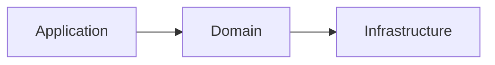
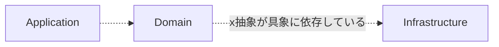
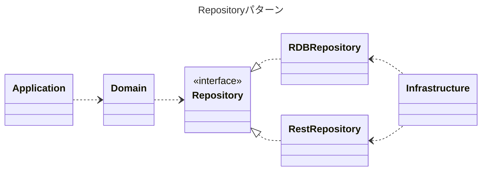

---
# try also 'default' to start simple
theme: seriph
# random image from a curated Unsplash collection by Anthony
# like them? see https://unsplash.com/collections/94734566/slidev
background: https://source.unsplash.com/collection/94734566/1920x1080
# apply any windi css classes to the current slide
class: 'text-center'
# https://sli.dev/custom/highlighters.html
highlighter: shiki
# show line numbers in code blocks
lineNumbers: false
title: ActiveRecordパターンの呪縛を学びほぐして挑むクリーンアーキテクチャへの入り口
# some information about the slides, markdown enabled
info: |
 ActiveRecordパターンに引きづられて設計が歪みがちになるのを学びほぐすことでクリーンアーキテクチャでの開発の良いスタートラインに立てるのではないでしょうか？

# persist drawings in exports and build
drawings:
  persist: false
# page transition
transition: slide-left
# use UnoCSS
css: unocss
fonts:
  # basically the text
  sans: 'Noto Sans JP'
  # use with `font-serif` css class from windicss
  serif: 'Noto Serif JP'
  # for code blocks, inline code, etc.
  mono: 'Noto Sans Mono'
addons:
  - "@katzumi/slidev-addon-qrcode"
  - "@katzumi/slidev-addon-blog-card"
  - "slidev-addon-components"
---

# ActiveRecordパターンの呪縛を学びほぐして挑むクリーンアーキテクチャへの入り口

[PHPカンファレンス沖縄2023](https://phpcon.okinawa.jp/)　Sep 16th, 2023.  
v0.0.4

<div class="pt-12">
  <span @click="$slidev.nav.next" class="px-2 py-1 rounded cursor-pointer" hover="bg-white bg-opacity-10">
    Press Space for next page <carbon:arrow-right class="inline"/>
  </span>
</div>

<div class="abs-br m-6 flex gap-2">
  <button @click="$slidev.nav.openInEditor()" title="Open in Editor" class="text-xl slidev-icon-btn opacity-50 !border-none !hover:text-white">
    <carbon:edit />
  </button>
  <a href="https://github.com/k2tzumi/clean-architecture-anti-pattern/blob/main/slides.md" target="_blank" alt="GitHub"
    class="text-xl slidev-icon-btn opacity-50 !border-none !hover:text-white">
    <carbon-logo-github />
  </a>
</div>

<!--
The last comment block of each slide will be treated as slide notes. It will be visible and editable in Presenter Mode along with the slide. [Read more in the docs](https://sli.dev/guide/syntax.html#notes)
-->

---
transition: fade-out
layout: two-cols-header
---

# 自己紹介

katzumi（かつみ）と申します  

「障害のない社会をつくる」をビジョンに掲げている「りたりこ」という会社に所属しています
<a href="https://litalico.co.jp/">

</a>

以下のアカウントで活動しています    

::left::

  
<QRCode width="180" height="180" value="https://twitter.com/katzchum" color="4329B9" image="Logo_of_Twitter.svg" />

<logos-twitter /> [katzchum](https://twitter.com/katzchum)

::right::


<logos-github-octocat /> [k2tzumi](https://github.com/k2tzumi)  
<simple-icons-zenn /> [katzumi](https://zenn.dev/katzumi)  

<br />

<style>
h1 {
  background-color: #2B90B6;
  background-image: linear-gradient(45deg, #4EC5D4 10%, #146b8c 20%);
  background-size: 100%;
  -webkit-background-clip: text;
  -moz-background-clip: text;
  -webkit-text-fill-color: transparent;
  -moz-text-fill-color: transparent;
}
</style>

---
layout: default
transition: fade-out
---

# 日々ちょうぜつ分厚い本と向き合っています
圧巻の1.5K頁オーバー。3年に一回、大改訂（大改定）があります。レセプト業務の基盤システムを開発しています！先月ツナギメエフエムにゲスト出演してお話をさせて頂きました！


<!--
先月、ツナギメエフエムの [Ep.52](https://listen.style/p/tsunagimefm/tnjsz79v) でゲスト参加して所属会社や業務のことを話たので興味のある方は視聴してみてください
-->

---
layout: two-cols-header
transition: fade-out
---


# お願い

写真撮影、SNSでの実況について

登壇者の励みになるので是非ともご意見やご感想など、フィードバック頂けると助かります mm  
あとでスライドを公開します

::left::

<Transform :scale="2.5">
　　　🙆‍♀📷<ph-projector-screen-chart-light /><br />
　　　🙅‍♂📹💸<br />
　　　🙅📸👨‍👦‍👦<br />
</Transform>

::right::

<br />
<Transform :scale="2">
<logos-discord-icon />
</Transform>
<br />
<a href="https://discord.com/channels/1150751595089371290/1150782186568556594">#trackb-1540-activerecordパターンの呪縛を学びほぐして挑むクリーンアーキテクチャへの入り口</a>
<br />
<Transform :scale="2">
<fa6-brands-square-x-twitter />
</Transform>
<br />
<a href="https://twitter.com/search?q=%23phpcon_okinawa%20%23track_b">#phpcon_okinawa #track_b</a>


<!-- 本セッションでは、撮影やSNS拡散を歓迎しています。ご自由に写真を撮影して、XなどのSNSでシェアしてください。 　　
ただし、以下の点にご注意ください。　　

著作権などの法的な問題を避けるために、スライドや登壇者の写真や動画を無断で商用利用しないでください。　　
他の参加者のプライバシーや迷惑にならないように、撮影や投稿する際には配慮してください。　　
SNSでシェアする際には、ハッシュタグ「#phpcon_okinawa　#trackB」をつけてください。　　
これにより、本セッションの関連情報を簡単に検索できるようになります。 -->


---
layout: two-cols-header
---

# 今日お話すること・話さないこと
スコープ的なお話

::left::

### 🤫話さないこと

- 具体的な実装例  
このセッションでは設計パターンの原理・原則に焦点を当てます
- クリーンアーキテクチャへの移行手法  
- オブジェクト指向の基本的な概念や用語

::right::

### 📣話すこと

- 設計の原理・原則及びパターンの適用条件  
- クリーンアーキテクチャの目指すゴール
- ActiveRecordパターン経験者が陥りがちなアンチパターン
- 今後のActiveRecordとの付き合い方
- クリーンアーキテクチャとの相性の良い設計パターン

---
transition: slide-up
layout: two-cols-header
---

# 本セッションのゴール🏁

::left::

## 🤓ActiveRecordパターンの
## 経験者向け

アンチパターンに陥らない為の前提知識を得ること

::right::

## 🧐クリーンアーキテクチャに
## 興味がある人向け

採用のメリットや概念が理解できること

---
layout: default
---

# 学びほぐす「アンラーニング」とは？
What's unlearning?

<blockquote>
        <p>既得の知識・習慣を捨てること。</p>
        <p>環境変化の激しい現代社会を生き抜くために、過去の経験にとらわれないよう、意識的に学習知識を捨て去ること。</p>
</blockquote>

[コトバンク（デジタル大辞泉）より](https://kotobank.jp/word/%E3%82%A2%E3%83%B3%E3%83%A9%E3%83%BC%E3%83%8B%E3%83%B3%E3%82%B0-178709)


---
layout: default
---

# ActiveRecordパターンとは？

皆んな大好きActiveRecordパターン  

データベースの操作をオブジェクト指向で行うデザインパターン  
ActiveRecordパターンでは、テーブルと1対1で対応するモデル（クラス）を作ります。  
モデルはテーブルの行と1対1で対応し、各行の属性（カラム）はモデルのプロパティにします。  
これにより、オブジェクト指向の方法でデータベースを操作できます。[^1]

[^1]: ChatGPTさん曰く

---
layout: fact
transition: fade-out
---

# <logos-composer />
# 各種フレームワーク
# ライブラリで採用
---
layout: two-cols
---

## フルスタックフレームワーク

* Laravel <skill-icons-laravel-light />  
Eloquent ORM
* Symfony <skill-icons-symfony-light />  
Doctrine ORM
* Yii framework <devicon-yii-wordmark />  
ActiveRecord
* Ruby on Rails <logos-rails />  
ActiveRecord
* Spring Boot <devicon-spring-wordmark />  
Spring Data JPA

::right::

## ライブラリ

* Java <devicon-java-wordmark />  
Hibernate
* Golang <logos-gopher />  
GORM, XORM

---

# Eloquent ORMでのモデル作成


```console
$ php artisan make:model User
```
scaffoldして

<v-click>
```php
namespace App\Models;

use Illuminate\Database\Eloquent\Model;

class User extends Model
{
    protected $fillable = ['username', 'email'];

    protected $table = 'users';
}
```

こうなる（する）
</v-click>

---

# Eloquentモデルの使い勝手

```php {1-7|8-12|13-16|17-22}
use App\Models\User;

// ユーザーを作成
$user = new User();
$user->username = 'john_doe';
$user->email = 'john@example.com';
$user->save();

// ユーザーを更新
$user = User::find(1);
$user->email = 'updated_email@example.com';
$user->save();

// ユーザーを削除
$user = User::find(1);
$user->delete();

// ユーザーを検索
$users = User::all();
foreach ($users as $user) {
    echo $user->username . ': ' . $user->email . PHP_EOL;
}
```

---
layout: fact
---

# 👍 超絶便利！

---
layout: center
---

# SQL書かなくていい！
# テーブルとオブジェクトが自動的にマッピングされる！

---
layout: fact
transition: slide-up
---

# ⛏深掘りしてみる

---
layout: image-right
image: https://m.media-amazon.com/images/I/51QgGZaWj-L._SX515_BO1,204,203,200_.jpg
---

# 由来

RailsのActiveRecordが初出ではない

Ruby on RailsのActiveRecordという名称は、マーチンファウラー氏の書籍「Patterns of Enterprise Application Architecture（PoEAA）」(2002年出版)で紹介されたActiveRecordパターンに由来しています。[^1]

[^1]: パターンをまとめた設計カタログで、用語自体はもっと先からあった模様

<!--
エンタープライズ・アプリケーション開発者が直面する厳しい課題に直接応えるために書かれた。
著者が同じ設計アイデアが共通の問題に適用できると気づき、専門家の協力で40種類のパターンを抽出してまとめたもの。
Railsの最初のバージョン公開は2004年になります
-->

---

# PoEAAで紹介されている設計カタログ
以下の9つのカテゴリに40種類のパターンをまとめられている [^1]

1. Domain Logic Patterns
2. Data Source Architectural Patterns
3. Object-Relational Behavioral Patterns  
4. Object-Relational Structural Patterns
5. Object-Relational Metadata Mapping Patterns
6. Web Presentation Patterns
7. Distribution Patterns
8. Session State Patterns
9. Base Patterns

[^1]: 各パターンの邦訳名は以下URLを参照  
https://bliki-ja.github.io/pofeaa/CatalogOfPofEAA_Ja

---

# PoEAAで紹介されている設計カタログ
ActiveRecordパターンに言及されている領域

1. Domain Logic Patterns

<div class="mention">
2. Data Source Architectural Patterns　←　ココ！
</div>  

3. Object-Relational Behavioral Patterns  
4. Object-Relational Structural Patterns  
5. Object-Relational Metadata Mapping Patterns  
6. Web Presentation Patterns  
7. Distribution Patterns  
8. Session State Patterns  
9. Base Patterns  

---
transition: fade
---

# Data Source Architectural Patterns

Data Source Architectural Patternsは、データベースとのやり取りをするためのパターンをまとめたもの

* Table Data Gateway  
データベースのテーブルに対する操作を提供するオブジェクトのパターン
* Row Data Gateway  
データベースの行に対応するオブジェクトのパターン
* <div class="mention">Active Record　←　コレ！</div>  

  データベースの行に対応するオブジェクトで、自分自身を保存や削除できるパターン  
* Data Mapper  
データベースの行とドメインオブジェクトの間のマッピングを担当するオブジェクトのパターン

---
transition: fade
---

# ActiveRecordとは？

https://bliki-ja.github.io/pofeaa/ActiveRecord より

"An object that wraps a row in a database table or view, encapsulates the database access, and <div class="mention">adds domain logic on that data.</div>  
An object <div class="mention">carries both data and behavior. </div> "

> データベースのテーブルやビューの列をラップし、データベースアクセスをカプセル化し、<div class="mention">ドメインロジックを追加するオブジェクト</div>
> <div class="mention">データと振る舞いの両方を持つ</div>オブジェクト

---
layout: center
transition: fade
---

# Data Source? 🤔

---

# データベースとのやり取りをするだけではない！

Data Source以外のパターンも混ざっている

* <div class="mention">Domain Logic Patterns　←　特にココ！</div>  
ビジネスロジックの一部であるドメインロジックを実装するためのパターンをまとめたもの  
* Object-Relational Behavioral Patterns  
オブジェクトとリレーショナルデータベースの間の振る舞いの問題を解決するためのパターンをまとめたもの  
* Object-Relational Structural Patterns  
オブジェクトとリレーショナルデータベースの間の構造の問題を解決するためのパターンをまとめたもの  
* Object-Relational Metadata Mapping Patterns  
オブジェクトとリレーショナルデータベースの間のマッピングをメタデータで管理するためのパターンをまとめたもの  

<!--
* Object-Relational Behavioral Patterns  
  * Unit of Work  
Active Recordは、オブジェクトの変更を追跡し、データベースに一括で反映するパターンを有する
  * Identity Map  
Active Recordは、同じデータベースのレコードに対応するオブジェクトを一意に管理するパターンを有する
* Object-Relational Structural Patterns  
  * Identity Field  
Active Recordは、オブジェクトに一意な識別子を持たせるパターンを有する
  * Foreign Key Mapping  
Active Recordは、オブジェクトの関連をデータベースの外部キーで表現するパターンを有する
* Object-Relational Metadata Mapping Patterns  
  * Metadata Mapping  
Active Recordは、オブジェクトとデータベースのマッピングは設定より規約（convention over configuration）で表現します
-->

---
layout: center
transition: fade
---

# 💎ActiveRecordは凄くリッチなパターン

---

# ActiveRecordパターンが向いているケース

* ドメインロジックがシンプル
* ドメインモデルとテーブルの構造が非常に近い  
  以下「全てを1対1で関連付けを行う」が前提
  * テーブルとクラス
  * 行とインスタンス
  * カラムとプロパティ

<br />

<v-click>

<div class="fusen">
前提（適用条件）を満たしていれば非常に強力！<br />  
強力すぎるが故に前提を崩さないように設計時に注力するようになる<br />  
</div>

</v-click>

---

# 悪い兆候 🚩Red flags
前提が崩れ始めてきた際に出現するワード

* Fat Model
* Fat Controller
* MVAC
* Service Object

---
layout: center
transition: slide-up
---

# 🤮責務が溢れてきてしまっている

---

# 関心事（＝責務）を分けて考えると
ドメインの振る舞いとデータの永続化は別レイヤーの関心事

ActiveRecordパターンは

  <div class="mention">Domain Model</div>(Domain Logic Patterns) + <div class="mention">Row Data Gateway</div>(Data Source Architectural Patterns)

２つのパターンに分解できる。  
<br />
業務ロジックを持ったRow Data Gateway。  
<br />  


<div class="box-text-memo">
ActiveRecordパターンは敢えてレイヤーを分けずに密結合にしてDRY(Don't Repeat Your Self：繰り返しを避けること)に書けるように注力しています。
</div>

---

# レイヤードにしていく理由
アプリケーションの責務を分割する

* 責務を明確にし、複雑性の排除を行う 
* テストしやすくする  
* 変更の影響を局所化させる  

<br />

<div class="box-text-memo">
ざっくり要約すると。。<br />  
各層の責務と依存関係を明確にすることで、本質的な問題と向き合うため
</div>

---
layout: center
transition: fade
---

# レイヤー増えるだけなの？
# それってServiceLayer足しただけでは？🤔

---
layout: fact
---

# マインドセット
# が
# 違う
何を主として考えるか？

---
layout: image-right
image: https://www.martinfowler.com/eaaCatalog/ServiceLayerSketch.gif
---

# データソースを中心にした設計

DomainがData Sourceに依存している

データソースを変更した場合にドメインモデルが影響を受ける

<arrow x1="500" y1="435" x2="700" y2="300" color="red" width="3" arrowSize="2" />

---

# ドメインモデルを中心にした設計

[The Clean Architecture](https://blog.cleancoder.com/uncle-bob/2012/08/13/the-clean-architecture.html)


データソースレイヤーは外に配置されている

<arrow x1="90" y1="500" x2="110" y2="400" color="red" width="3" arrowSize="2" />

---
layout: fact
---

# 設計の原則

## DRY vs SOLID
アプローチと目指しているものが違う

---
layout: image-right
image: https://m.media-amazon.com/images/I/51LkcwTMC8L._SX387_BO1,204,203,200_.jpg
---

# Clean Architecture　達人に学ぶソフトウェアの構造と設計
第Ⅲ部 設計の原則

* SOLIDの原則  
設計の原則がコンポーネントレベルまで適用されている

---

# SOLIDの原則
設計の原則の頭文字

<Transform :scale="1.5">

* <div class="mention">S: 単一責任の原則（SRP: Single Responsibility Principle）</div>
* O: 開放閉鎖の原則（OCP: Open-Closed Principle）
* L: リスコフの置換原則（LSP: Liskov Substitution Principle）
* I: インターフェース分離の原則（ISP: Interface Segregation Principle）
* <div class="mention">D: 依存性逆転の原則（DIP: Dependency Inversion Principle）</div>

</Transform>

<!--
5つ原則がありますが、重要なのは最初のSと最後のDになります。  
時間がないので本日はその2つのみ説明します。  
資料が後で公開されるので、後でご参照ください。
-->

---

# SRP: 単一責任の原則
Single Responsibility Principle

一つのモジュールやクラスは、一つの機能だけを持つべきであるという原則  
これにより、コードの変更やテストがし易く再利用性が向上する

### 🚩 悪い兆候
多目的クラス, 神クラス, 責務の不明確さ

<v-click>

<div class="fusen">
クリーンアーキテクチャでは、各層やコンポーネントが単一の責務を持つように設計されます<br />
レイヤーごとに責務を分けることで、変更が他のレイヤーに影響しないようにしています  
</div>

</v-click>

---

# OCP: 開放閉鎖の原則
Open-Closed Principle

ソフトウェア要素は、拡張には開いており、修正には閉じているべきであるという原則。  
これにより、ソースコードを変えずに機能を拡張でき、保守性や再利用性が向上する

### 🚩 悪い兆候
条件分岐の乱用, 責務過多

<v-click>

<div class="fusen">
クリーンアーキテクチャでは、内側の層が外側の層に対して開放されており、外側の層が内側の層に対して閉鎖されます<br />
内側のレイヤーは外側のレイヤーに影響されないようにし、外側のレイヤーは内側のレイヤーを拡張することができます
</div>

</v-click>

---

# LSP: リスコフの置換原則
Liskov Substitution Principle

派生クラスは、その基底クラスと置換可能であるべきであるという原則。  
これにより、型の互換性や拡張性が保たれ、コードの再利用性や可読性が向上する

### 🚩 悪い兆候
事前条件の強化, 事後条件の弱化

<v-click>

<div class="fusen">
クリーンアーキテクチャでは、インターフェースを用いて抽象化された内側の層が、具体的な実装である外側の層に置き換えられるように設計されます<br />
内側のレイヤーは外側のレイヤーの具体的な実装を知る必要がなくなります
</div>

</v-click>

---

# ISP: インターフェース分離の原則
Interface Segregation Principle

インターフェースは、分離できるものは分離するべきであるという原則  
これにより、クライアントは不要なメソッドに依存しなくて済み、コードの可読性や保守性が向上する

### 🚩 悪い兆候
肥大化したインターフェース, 不完全なインターフェース

<v-click>

<div class="fusen">
クリーンアーキテクチャでは、各層やコンポーネントが必要最低限のインターフェースを持つように設計されます<br />
内側のレイヤーが外側のレイヤーの具体的な実装を知る必要がなくなります
</div>

</v-click>

---

# DIP: 依存性逆転の原則
Dependency Inversion Principle

プログラムの重要な部分は、逆に重要でない部分にが依存しないようにするべきである。  
そのためにモジュールは、抽象に依存するようにするべきであるという原則  
これによりモジュールは、実装の詳細に左右されなくなり、コードの柔軟性や再利用性が向上する

### 🚩 悪い兆候
抽象が具象に依存する

<v-click>

<div class="fusen">
クリーンアーキテクチャでは、依存性逆転の原則を適用しています<br />
内側の層が外側の層に依存しないように設計されています<br />
</div>

</v-click>

---
layout: center
---


# The Clean Architecture（≠Clean Architecture）の誤解😕

---

# 親の顔より見た図
本日10ページぶり2回目の登場


「Clean Architecture」の22章の中で例示されているLayered Architecture

---

# 誤解されている内容
やたら独り歩きしている感

* この通りに実装するのが正解  
Clean Architectureの具体例として挙げられているだけ
* レイヤーは4層  
レイヤーは4つ以外は認めないというルールはないと明記されている
* MVC1に近い構成にしないといけない  
そもそもWebアプリケーション以外 [^1] も想定している図なので盲信すると危険！  
最近のWebアプリケーションの構成と乖離が出てくる  
* 他にも色々あるけれど。。

[^1]: 同心円の外側のDevices, UI, External Interfacesがソレ<br />それぞれ、キーボードやNativeアプリ(GUI)、CLI、メールやイベント・キューとかもありそう

<!--
クリーンアーキテクチャの図は、一般的なソフトウェア設計の原則やパターンを示すものであり、特定の実装や構成を強制するものではありません。  
PresenterでOutput BoundaryはMVC2なら要らないと思います
-->

---

# 本質的な２つルール

<Transform :scale="0.8">


<br />

* 依存の方向は外側から内側のレイヤーにのみ向ける[^1]  
* 制御の流れと依存の向きは依存性逆転の原則で分離してコントロールする

</Transform>

[^1]: 依存関係は隣接するレイヤー間のみに限定されるわけではないので注意

<box 
  left="70px"
  top="225px"
  width="135px"
  height="45px"
  borderColor="red"
  borderWidth="3px"
  borderStyle="solid"
  backgroundColor="#44ffd233"
  />

<arrow x1="110" y1="410" x2="110" y2="275" color="red" width="3" arrowSize="2" />

---

# 各層（レイヤー間）の関係性
円の内側は高レイヤーで外側は低レイヤーとする


|レイヤー<br />位置|抽象度 [^1]|重要度[^2]|安定度[^3]|具体的な<br />コンポーネント|役割|
|---|---|---|---|---|---|
|内側|高い<br />（抽象）|高い|高い|ビジネスルール<br />ドメインモデル|ソフトウェアの本質的部分や目的を表すもの|
|外側|低い<br />（具象）|低い|低い|データソース<br />（データベース,Web API）|ソフトウェアの技術的詳細や手段を表すもの|

[^1]: 抽象度とは、コンポーネントが具体的な実装や詳細から独立している程度を表す指標
[^2]: 重要度とは、システムが解決しようとしている課題や問題領域の関心事にどれだけ適合しているかを表す指標。<br />高い場合は修正の影響が大きい（テスト含めて）
[^3]: 安定度とは、修正されにくい度合い又は、依存性関係が少なく他のモジュールの修正の影響を受けづらい度合い


<style>
.slidev-layout {
  font-size: 0.9em;
}
</style>

---
layout: center
transition: fade
---

# 抽象度と重要度と安定度は連動する

<v-click>

。。のか？

</v-click>

---
layout: center
transition: fade
---

# 🙅‍♀️

<v-click>

違う、そうじゃない  

</v-click>

<style>
.slidev-vclick-target {
  transition: opacity 200ms ease;
  text-align: center;
  font-size: 3em;
  line-height: 1;
}
</style>

---
layout: center
---

# 🙆‍♀　重要度に対して抽象度を調整し安定度をコントロールする

---
transition: fade
---

# 各層（レイヤー間）の <div class="mention">目指す</div>関係性
円の内側は高レイヤーで外側は低レイヤーとする

|レイヤー<br />位置|抽象度 [^1]|重要度[^2]|安定度[^3]|具体的な<br />コンポーネント|役割|
|---|---|---|---|---|---|
|内側|高い<br />（抽象）|高い|高い|ビジネスルール<br />ドメインモデル|ソフトウェアの本質的部分や目的を表すもの|
|外側|低い<br />（具象）|低い|低い|データソース<br />（データベース,Web API）|ソフトウェアの技術的詳細や手段を表すもの|

[^1]: 抽象度とは、コンポーネントが具体的な実装や詳細から独立している程度を表す指標
[^2]: 重要度とは、システムが解決しようとしている課題や問題領域の関心事にどれだけ適合しているかを表す指標。<br />高い場合は修正の影響が大きい（テスト含めて）
[^3]: 安定度とは、修正されにくい度合い又は、依存性関係が少なく他のモジュールの修正の影響を受けづらい度合い

<style>
.slidev-layout {
  font-size: 0.9em;
}
</style>

---
transition: fade
---

# 各層（レイヤー間）の <div class="mention">目指す</div>関係性
<div class="mention">重要度の高いものコアとし、中心に据える</div>

|レイヤー<br />位置|<div class="mention">重要度</div>[^1]|抽象度 [^2]|安定度[^3]|具体的な<br />コンポーネント|役割|
|---|---|---|---|---|---|
|内側|高い|高い<br />（抽象）|高い|ビジネスルール<br />ドメインモデル|ソフトウェアの本質的部分や目的を表すもの|
|外側|低い|低い<br />（具象）|低い|データソース<br />（データベース,Web API）|ソフトウェアの技術的詳細や手段を表すもの|

[^1]: <div class="mention">重要度とは、システムが解決しようとしている課題や問題領域の関心事にどれだけ適合しているかを表す指標。</div><br /><div class="mention">高い ＝ 内部品質の高さが求められるコアとなるもの</div>
[^2]: 抽象度とは、コンポーネントが<div class="mention">他の具体的な実装や詳細から独立させた度合い</div>の指標
[^3]: 安定度とは、修正されにくい度合い又は、<div class="mention">依存性関係を少なくし、他のモジュールの修正に閉じている状態</div>の度合い

<style>
.slidev-layout {
  font-size: 0.9em;
}
</style>

<!---
内部品質とは？  
モジュール性 (modularity)  
再利用容易性 (resability)  
解析容易性 (analysability)  
変更容易性 (modifiability)  
テスト容易性 (tesability)  
-->

---
transition: fade
---

# SDP: 安定依存の原則
Stable Dependencies Principle

パッケージ設計の原則の一つで、パッケージの依存は常により安定したパッケージに向くべきであるという原則

安定したレイヤーに依存しないといけない  
不安定なレイヤーに依存すると、その依存しているレイヤーが不安定になる

<v-click>

<div class="fusen">
クリーンアーキテクチャでは、重要度が一番高いもの=ドメインモデルとしている<br />
ドメインモデルの設計を長期的に安定させるという考え方
</div>

</v-click>

---
transition: fade
layout: section
---

# 🙃技術的な詳細で不安定なデータソースにドメインが依存するのはおかしい！
抽象が具象に依存する

---

# 複雑で不安定なものから切り離す手法
制御の流れと依存の向きは連動してしまう

  * 制御のフロー  

  * 依存の向き  


<div class="box-text-memo">
※説明を単純にする為にレイヤーを3層にした例<br />
PoEAA的に以下の関心事に対応<br />
Application: Web Presentation<br />
Domain: Domain Logic<br />
Infrastructure: Data Source<br />
</div>

---
transition: fade
---

# 複雑で不安定なものから切り離す手法
ドメインモデルの永続化するのに具象に依存させない

* 依存性逆転の原則  
ドメイン層はインターフェースに依存させることで永続化技術の詳細から隔離させる


---
layout: center
---

# ✨これで本当にCleanといえるのか？

---

# ドメインが持つ依存を排除し抽象度を上げる
ドメインモデルをもっと安定させる

* アプリケーションサービス  
アプリケーションサービスは、ドメイン層とプレゼンテーション層の間に位置し、ドメインオブジェクトやレポジトリなどを利用して、アプリケーションの要求を満たす。  


<v-click>

<box 
  left="460px"
  top="265px"
  width="160px"
  height="100px"
  borderColor="red"
  borderWidth="3px"
  borderStyle="solid"
  backgroundColor="#44ffd233"
  />

<box 
  left="620px"
  top="265px"
  width="150px"
  height="100px"
  textColor="red"
  title="完全に独立"
  />

</v-click>

---
layout: center
transition: slide-up
---

# レイヤー間だけでなく
# クラス（コンポーネント）間にも
# SOLID・パッケージ設計の原則は適用可能
Clean Codeという考え方

---
layout: image-right
image: https://svgsilh.com/svg/2022412.svg
---

# ActiveRecordパターンの呪縛のまとめ

---
transition: fade
---

# ActiveRecordパターンの呪縛
認知バイアス多め

* ドメインモデルとテーブルを1:1にしないといけない  
データ永続化とドメイン振る舞いを一体化させる思い込み
* テーブル設計を先にし、モデルに制約を後付けする  
それが一番早くて黄金パターンだという成功体験（シンプルなドメインのみという前提無視）
* レコード＝ドメインオブジェクトでいつでも更新・削除は簡単  
オブジェクトの属性を更新したり、saveやdeleteがいつでもカジュアルにできる（表面的な操作としては）


---
layout: fact
transition: fade
---

# ああ・・・
# クセになってんだ

---
layout: fact
---

# 学びほぐし事例集

---

# アンラーニング、その前に…
ここからの注意点

* 新しい用語が複数出てきます  
詳細な説明はしません
* クリーンアーキテクチャでの設計に興味を持ってもらうことが目標です  
気になった用語はワードだけ覚えて、後で自分で調べるスタイルでお願いします 🙇‍♀
* アンチパターンとその対処法になります  
以前の考え方や行動パターンと対比して新しいものに触れます
* 全てやらないとクリーンアーキテクチャにならないわけではありません[^1]  
設計パターンなので、思考の流れを理解するのが大事です
* クリーンアーキテクチャの経験者は一緒に内省しましょう😅 [^2]

[^1]: [The Clean Architectureの誤解](./48)で触れた通り
[^2]: 登壇者は紹介するアンチパターンの全てに心当たりがあります

---
layout: fact
---

# <material-symbols-counter-1 />テーブル定義 = Domain modelのプロパティ
表面的なデータ構造だけで設計してませんか？  

---

# 学びほぐし事例<material-symbols-counter-1 />の変革の必要性
ActiveRecordは必ず1対1にしていたけれど

* テーブル設計 != モデル設計  
論理設計と物理設計を同じと思っている[^1]  
テーブル設計の変更に影響を受ける  
* Valueオブジェクト[^2]や集約[^3]が表現されていない  
振る舞いや制約がないか、分散してしまっている  
primitiveな型Onlyは要注意
* テーブルの正規化対応できない  
単純に関連モデルとして実装すると、データ構造が露出する

[^1]: 日本語論理名を英語に翻訳するだけとか。。
[^2]: 同一性を持たず、属性が同じなら同じと扱うオブジェクト。例えば、日付や金額など
[^3]: 一貫性を保つ必要があるドメインオブジェクトのまとまり。トランザクション境界にもなる

---

# 学びほぐし事例<material-symbols-counter-1 />のブレークスルー
ドメインファーストな設計をしましょう。永続化はレイヤーを分けて次に考えましょう

* まずはドメインに向き合いましょう  
  1. ドメインの問題領域を理解する  
  2. ユビキタス言語を定義する  
  3. ドメインオブジェクトを識別する  
  オブジェクトの種類を決めValueオブジェクトや集約を識別する。  
  振る舞いや関係（協調・制約）も洗い出す

<!--
関係とは、ドメインオブジェクト同士の相互作用や依存を指しています。
-->

---
layout: fact
---

# <material-symbols-counter-2 />モデルにsetterが存在  
プロパティが書き換え可能

---

# 学びほぐし事例<material-symbols-counter-2 />の変革の必要性
ActiveRecordはミュータブルなモデル

* 状態を変更した際に副作用が発生する可能性がある  
制約をすり抜けてしまう
* コードの可読性が悪い
* ドメインイベントを見落とす  
手続き的にsetterを呼び出しされても意図が伝わらない  
ビジネスルールがあっても認識されない[^1]

[^1]: 後からビジネスルールの追加があった場合などに対応漏れが発生する

---

# 学びほぐし事例<material-symbols-counter-2 />のブレークスルー
オブジェクト作成後にその状態を変えることをできなくする（不変オブジェクトにする）

* イミュータブルなモデルにしましょう  
ドメインイベント毎に適切なメソッドを定義しましょう
* コンストラクタで制約を定義しましょう  
イミュータブルなモデルでコンストラクタに制約が定義されていれば、各種イベントで状態が変化しても制約が必ず有効になります

---
layout: fact
---

# <material-symbols-counter-3 />コンストラクタに制約がない  
引数の型指定も制約になります

---

# 学びほぐし事例<material-symbols-counter-3 />の変革の必要性
ActiveRecordは制約違反があってもオブジェクト自体は存在できてしまう

* 制約違反したオブジェクトが存在できてしまう  
制約をすり抜けて整合性や一貫性が失われる
* validメソッドが実装されていても制約違反を発見するタイミングが遅い  
validメソッドの呼び忘れも起こる
* ビジネスルールがわからなくなる  
認知負荷が高くなる
* ドメインの制約を守る実装がそのドメインモデルを使う人任せになってしまう  
ビジネスルールが散らばってしまう

<div class="box-text-memo">
ドメインモデルがgetter・setterしかない場合にドメイン貧血症と言われます<br />
個人的にはコンストラクタの制約がないことが問題だと感じています
</div>

---

# 学びほぐし事例<material-symbols-counter-3 />のブレークスルー
イミュータブルな設計とセットでコンストラクタに制約を実装する

* 適切にコンストラクタに制約を定義しましょう  
制約違反したオブジェクトが存在しないことが保証される  
また、制約違反を発見するタイミングが早くなる
* イミュータブルなモデルにしましょう  

---
layout: fact
---

# <material-symbols-counter-4 />読み込みと書き込みのモデルが同じ
データの永続化と読み込みの両方に同じモデルを使用する  

---

# 学びほぐし事例<material-symbols-counter-4 />の変革の必要性
ActiveRecordではテーブルとの関連は原則1:1。分けれなくもないけれど普通はやらない

* 正規化したデータをうまく扱えない  
書き込み時はコードのみ、名称は不要  
逆に読み込み時には名称も一緒にロードして表示したい  
* データ更新時に不要なデータまで必要になる  
モデルが複雑で関連するデータが多い場合に準備が大変
* 一括更新になりがちでデータの不整合が発生する  
不要なカラムまで更新して、同時更新されると不整合となる

---

# 学びほぐし事例<material-symbols-counter-4 />のブレークスルー
ReadオブジェクトとWriteオブジェクトを分ける  

* データの更新（コマンド）と参照（クエリ）を別のモデルに分ける[^1]  
コマンド・クエリ責務分離（Command-Query Responsibility Segregation, CQRS）の原則に従う。  
* コマンドは正規化してデータの一貫性と整合性を保つ  
* クエリは非正規化してデータ参照時のパフォーマンスを上げる

[^1]: モデルだけでなくデータソースも別にし、スケーラビリティやパフォーマンスを向上させる場合もあります。

---
layout: fact
---

# <material-symbols-counter-5 />ユースケース毎に適切なコマンドがない  
データの新規登録と更新の両対応のメソッドが定義されている

---

# 学びほぐし事例<material-symbols-counter-5 />の変革の必要性
ActiveRecordでCRUDが簡単にでき、最新状態を常に上書きしていたけれど

* ドメインのイベントを見落としている[^1]  
* 新規登録時と更新時の制約が違うケースがある

[^1]: モデルにnull許可のプロパティが多い場合は情報が混ざっている可能性がある

---

# 学びほぐし事例<material-symbols-counter-5 />のブレークスルー
事実を失う操作（更新・削除）を行わせない、データの構造や関係とする

* イミュータブルデータモデルで設計してみる  
更新と削除を行わないテーブル設計[^1]  
エンティティをイベントとリソースに分けてモデリングする
* コマンドのオブジェクトを分けるようにする  
新規登録用のオブジェクトと更新用のオブジェクト（イベント対象と内容のみ）で分ける

<div class="box-text-memo">
イミュータブルデータモデルは、イベントソーシングパターンとも相性が良いです。<br />
イベントの量が多くなった際に分散処理しやすくなります。
</div>

[^1]: [T字形ER データベース設計技法](https://www.amazon.co.jp/T%E5%AD%97%E5%BD%A2ER-%E3%83%87%E3%83%BC%E3%82%BF%E3%83%99%E3%83%BC%E3%82%B9%E8%A8%AD%E8%A8%88%E6%8A%80%E6%B3%95-%E4%BD%90%E8%97%A4-%E6%AD%A3%E7%BE%8E/dp/488373109X)と相性が良いです

---
layout: fact
---

# <material-symbols-counter-6 />ユースケース毎に適切な粒度のクエリがない 
集約がうまく扱えていない

---

# 学びほぐし事例<material-symbols-counter-6 />の変革の必要性
ActiveRecordはデフォルトでLazy Loadが前提になっているけれど

* データの関連を適切にクエリとして表現する必要がある  
集約をクエリとして表現しないと、クエリ間 [^1] でもN+1が起こる
* 集約データをRepositoryから取得する際の戻り値がEager Loadになる  
Lazy Loadでエンティティを返すにはテクニックが必要

[^1]:個々のクエリを再利用してしまい、APIでもN+1で呼び出される危険性がある

---
transition: slide-up
---

# 学びほぐし事例<material-symbols-counter-6 />のブレークスルー
パフォーマンスに考慮したクエリを定義する

* 集約を扱うクエリを適切に定義する  
集約ルートに対して一覧表示や詳細表示などのシーンに応じてクエリを最適化する
* 集計機能実装時にデータベースの力を借りる  
大量データをメモリロードせずに、集計関数を利用する

---
layout: fact
---

# Hello world!! 
## Clean Architecture🎉
学習おつかれさまでした

---
layout: fact
---

# Good by ActiveRecord?🤔
クリーンアーキテクチャとActiveRecordって相性悪くない？

---

# ソフトウェア設計における戦術と戦略の違い
戦略には中長期的な視点が必要

* 戦術（Tactics）  
個々のモジュールやクラスなどの小さなスコープで適用できる設計テクニック(Design Pattern)  
インターフェースと実装の分離や情報隠蔽など  
→　SOLID原則も含まれます
* 戦略（Strategy）   
システム全体や大きなスコープで適用できる設計テクニック(Architectural Pattern)  
モジュール間の依存関係や抽象化のレベルなど  
→　クリーンアーキテクチャ

---

# ActiveRecordは戦術？それとも戦略？
戦術を組み合わせることで戦略に昇華することができる

* PoEAA的にはData Source <div class="mention">Architectural Patterns</div>  
データソースを中心にした設計で戦略的
* ActiveRecordパターンは以下の設計思想・戦術を組み合わせるとより戦略的になる
  1. CoC (設定より規約)
  2. DRY (繰り返しを避ける)
  3. REST (RDBMSのCRUDとHTTPのリクエストメソッドに関連させる) [^1]

[^1]: ActiveRecordのモデル名とエンドポイントのURIも関連させる

---
layout: two-cols-header
---

# 戦略の相違

::left::
## 🏃‍♂️ActiveRecord

* レイヤーを分けずにDRYに書く戦略  
データソースやビジネスロジックの分離は考えない  

::right::

## 🌱クリーンアーキテクチャ

* レイヤーに分けて依存関係を分離し、品質を高める戦略  
ドメインからデータソースを意識させなくする 

---
layout: fact
---

# 【結論】
# 戦略として相性悪い
目指している方向性が違い、戦術的にもバッティングしてしまっている  
戦略なので設計時の思考にも反映されがちで矛盾が生じる  
(アンチパターンの要因)

---
layout: fact
---

# なので。。

---

# 今後のActiveRecord系ライブラリとの向き合い方
ActiveRecordは戦術的に使うだけに留める

* Infrastructure層のRepositoryでActiveRecordを使う [^1]  
ORマッパー・クエリービルダとして使う
* ただしドメインオブジェクトとActiveRecordオブジェクトへのマッピングが必要  
ドメインオブエジェクトではなくDTO（Data Transfer Object）, DPO（Data Persistence Object）の場合もあり [^2]

[^1]: Data Mapperでマッピングするほうが良いが、関心事が混ざる問題がある
[^2]: DPOはRepositoryのインターフェース側に定義させる

<!--
マッピングのメタデータをDomain Modelに書く（Attributeやアノテーション定義する）と関心事が混ざるので悩ましい
-->

---
transition: slide-up
---

# フレームワークとの関わり方にも通ずる
戦術なら変更は可能。戦略変更は計画的に

<Transform :scale="0.8">


<br />

* 一番外側に配置して、ユースケース・ドメインからは依存させないようにする
* 戦略的ではなく、戦術として使う（薄く利用する）  
戦術は局所的な影響に留めることができ、比較的容易に変更できることが多い

</Transform>

<box 
  left="280px"
  top="255px"
  width="150px"
  height="15px"
  borderColor="red"
  borderWidth="3px"
  borderStyle="solid"
  backgroundColor="#44ffd233"
  />

<arrow x1="320" y1="430" x2="320" y2="285" color="red" width="3" arrowSize="2" />

---
layout: image-right
image: https://source.unsplash.com/collection/94734566/960x1080
---

# まとめ

---

# 設計パターンの適用条件
再利用可能なケース

* ActiveRecordパターンの場合  
(DRY / 開発効率スピード重視 / 作るものがシンプルで明確)
  - データベースのテーブルとオブジェクトの構造がほぼ同じ
  - データベースの操作が単純
  - ビジネスロジックが複雑でない
* クリーンアーキテクチャの場合  
(SOLID / 変更容易性・拡張性重視 / 作るものが複雑で不明確、又は変更多い)
  - ビジネスロジックやドメイン知識が重要
  - 外部リソースやフレームワークに依存しないようにしたい
  - 変更や追加に柔軟に対応したい

---

# ActiveRecordの呪縛から逃れるには？

* ActiveReocrdは責務が多いので分解する
* SOLIDでコアなドメインになるようにモデリングする
* ドメインファーストな設計をする

---

# よりクリーンなコードにしていく

* 複雑なものは下位層に隠す  
データソースだけでなく他のものも
* モデルの表現を豊かにする  
Valueオブジェクト・集約・ドメインイベントを識別して、振る舞いや関係を定義する  
構造や振る舞いがわかりやすくする
* イミュータブルなモデル・データ構造にして一貫性を保つ
* CQRSの原則に従いスケーラビリティやパフォーマンスを高める  
将来的な分散システム（マイクロサービス等）への移行も視野に入れておく    
切り出しやすくして変化に強くする  
→　複雑さが下位層に隠れている状態

---

# Note
参考資料＆紹介した記事など

* [ツナギメエフエム Ep.52](https://listen.style/p/tsunagimefm/tnjsz79v)
* [ちょうぜつソフトウェア設計入門――PHPで理解するオブジェクト指向の活用](https://gihyo.jp/book/2022/978-4-297-13234-7)
* [Patterns of Enterprise Application Architecture / Martin Fowler's Bliki (ja)](https://bliki-ja.github.io/pofeaa/)
* [texta.fm 3.Low-Code Development](https://open.spotify.com/episode/5HOXIVtwaNOHRqB34RtjLc)
* [texta.fm 4.Not Just ORM](https://open.spotify.com/episode/5boIuz95jooLwsfcYjPN8g)
* [A Philosophy of Software Design を30分でざっと理解する](https://speakerdeck.com/iwashi86/understand-roughly-philosophy-of-software-design-in-30-minutes)
* [TM（T字形ER）によるモデリング](https://www.sea.jp/Events/symposium/ss2009/contents/07-Modeling/ss2009-modeling-slide-tokimoto.pdf)
* [PHPではじめるCQRSっぽいやつ](https://speakerdeck.com/dnskimo/phpdehazimerucqrstupoiyatu)
* [現場で役立つシステム設計の原則 〜変更を楽で安全にするオブジェクト指向の実践技法](https://gihyo.jp/book/2017/978-4-7741-9087-7)

---
layout: end
---

ご清聴ありがとうございました
